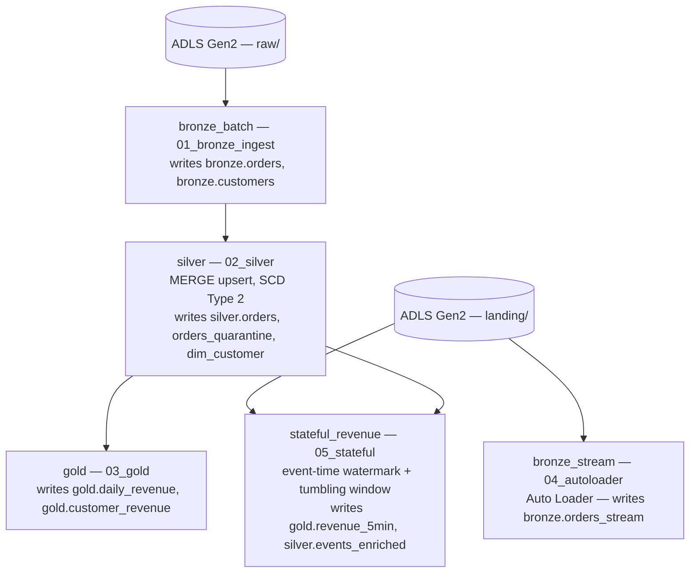
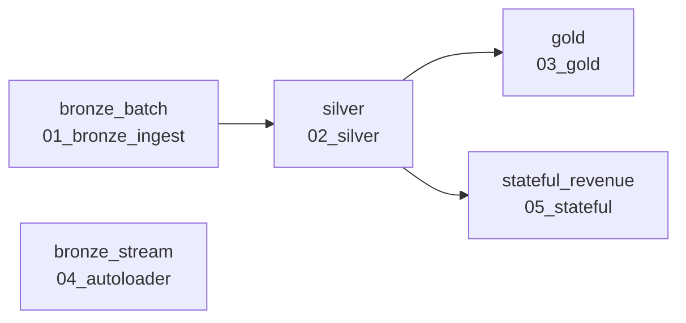

# Azure Databricks Medallion Pipeline

A batch and streaming medallion architecture built end to end on Azure Databricks with Unity
Catalog, Delta Lake, Auto Loader, Structured Streaming with event-time watermarks, and a
multi-task Lakeflow Job with a differentiated retry policy.

**Scope:** This is a demo-scale build. It demonstrates ingestion, idempotent upsert, SCD Type 2,
schema evolution, stateful windowed aggregation with event-time watermarking, and checkpoint
recovery.

---

## What it does

A retail order and customer feed is uploaded to ADLS Gen2 as CSV. The pipeline applies a schema,
cleans the data, tracks customer attribute changes over time, and produces revenue aggregates —
daily, per customer, and per five-minute window.

The source data is deliberately messy, and handling it is the point:

- Order status arrives in many spellings and casings that have to collapse to a single set of
  canonical values.
- Rows arrive with null or negative amounts, and with customer IDs that don't exist.
- The same order arrives more than once, with different update timestamps.
- Customer records arrive as full snapshots, so attribute changes have to be versioned rather than
  overwritten.
- A new column appears in a later file.
- Events arrive late, and out of order.

Each of these is addressed at a specific point in the pipeline described below.

---

## Architecture

All five tasks run as one Lakeflow Job against the Unity Catalog `retail` catalog.

**Authentication.** Databricks reaches ADLS through a Unity Catalog storage credential backed by an
Azure Access Connector managed identity, granted `Storage Blob Data Contributor` on the storage
account — not account keys, not SAS tokens. External locations built on that credential govern
access to the storage paths.

---

## Data model

Unity Catalog, catalog `retail`, three schemas:

| Table | Contents |
|---|---|
| `bronze.orders` | Raw order rows as they arrived, plus source file path and ingest timestamp. |
| `bronze.customers` | Customer records as they arrived — one row per customer, with the same lineage columns. |
| `bronze.orders_stream` | Order rows ingested by Auto Loader from the landing zone. |
| `silver.orders` | Typed, normalised, deduplicated orders that passed every quality rule. |
| `silver.orders_quarantine` | Rows that failed a quality rule, kept with the reasons they failed. |
| `silver.dim_customer` | Customer dimension as SCD Type 2 — one row per version, with validity dates and a current flag. |
| `silver.events_enriched` | Streaming events joined to the current customer record. |
| `gold.daily_revenue` | Revenue totalled per day. |
| `gold.customer_revenue` | Revenue totalled per customer. |
| `gold.revenue_5min` | Revenue totalled per five-minute event-time window. |

---

## Repository layout

| Path | Contents |
|---|---|
| `notebooks/01_bronze_ingest.ipynb` | ADLS raw → `bronze.orders`, `bronze.customers`. Explicit schema, `_metadata.file_path` and `_ingest_ts` lineage columns. Written with `mode=overwrite`, so a re-run produces the same table. |
| `notebooks/02_silver.ipynb` | Typing, status normalisation, quality split into clean and quarantine, dedup, `MERGE INTO` upsert, SCD Type 2 `dim_customer`. |
| `notebooks/03_gold.ipynb` | Aggregate tables — daily revenue and revenue per customer, with a three-way reconciliation check. |
| `notebooks/04_autoloader.ipynb` | Auto Loader (`cloudFiles`) on `landing/orders/` with `schemaLocation`, `checkpointLocation`, `Trigger.AvailableNow`, and `addNewColumns` schema evolution. |
| `notebooks/05_stateful.ipynb` | Structured streaming with `withWatermark` and a tumbling window, plus a stream-static join against `dim_customer`. |
| `jobs/p1-medallion-daily.yaml` | The Lakeflow Job definition — the DAG, retry policy and schedule as code rather than UI state. |

---

## The medallion layers

**Bronze** — the data as it arrived, plus lineage: every row carries the source file path and an
ingest timestamp.

Orders and customers are read differently, on purpose. Order files are **increments**, each one
holding only what is new, so the whole directory is read and the files stack together. Customer
files are **snapshots**, each a complete picture of every customer at a point in time, so a single
named file is read — reading the directory would stack two snapshots and duplicate every customer.

**Silver** — typed, normalised, deduplicated, and split.

Status values are normalised to a canonical set. Rows failing a quality rule are routed to
`silver.orders_quarantine` with the reasons they failed rather than dropped, so
`clean + quarantined = what arrived` always holds. Orders are upserted with `MERGE INTO` keyed on
`order_id`, so a re-run of the same batch changes nothing. `dim_customer` is SCD Type 2 with
`valid_from` / `valid_to` / `is_current`, verified by asserting that no customer has more than one
open row.

**Gold** — aggregates built on Silver: daily revenue, revenue per customer, and windowed revenue
from the streaming path.

---

## Orchestration

`p1-medallion-daily` — five tasks, two roots, one fan-out, on a shared single-node job cluster.

`bronze_stream` has no downstream task, and nothing reads `bronze.orders_stream`. The two paths
demonstrate two different ingestion mechanisms over order data — a plain batch read from `raw/`,
and Auto Loader with checkpointing and schema evolution from `landing/` — so they are kept
separate rather than merged into one lineage.

**Retry policy, differentiated:**

| Task | Retries | Reasoning |
|---|---|---|
| `bronze_stream` | 2 | Schema-evolution failure reports `can be fixed by an automatic retry: true`. It fails once, writes the new schema, and succeeds on restart. |
| `bronze_batch`, `silver`, `stateful_revenue` | 1 | Transient failures only — a storage permission that has not propagated yet, or a cluster that fails to start. |
| `gold` | **0** | A gold failure is deterministic — the same input produces the same failure, so a retry only burns compute and delays the alert. |

The job allows only one run at a time (`max_concurrent_runs: 1`). Two runs overlapping would mean
two streams writing to the same Auto Loader checkpoint — the record of which files have already
been processed — which would break exactly-once ingestion. The daily 02:30 IST schedule is defined
but left paused.

---

## Findings

**1. Schema evolution.** A file carrying an unexpected column (`promo_code`) was landed
deliberately. Auto Loader recorded the column and its type in the schema location, failed the
batch, and the job's retry succeeded with no code change and no human intervention. Row counts
afterwards confirmed that a failed streaming batch is replayed, never skipped and never duplicated.

**2. Schema evolution leaves two kinds of null, and they are indistinguishable.** After evolution,
the overwhelming majority of `promo_code` nulls mean *"this column did not exist when the row
landed"*; a handful mean *"the column existed and this order had no promo."* Ask "how many orders
had no promo?" and the query gives the wrong answer. Separable only via the `_source_file` and
`_ingest_ts` lineage columns — which is a large part of why they are in Bronze.

**3. Two symptoms, two different causes.** `bronze_stream` failed on its first attempt and succeeded
on the retry, and that first attempt took several times longer than the second — same notebook,
same cluster, same data. The failure was the unexpected column. The slowness was something else
entirely: both root tasks start together on a single two-core node, and by the time the retry ran
the other task had finished and the node was free. The task log separates the two; the run timings
on their own do not.

**4. The run reported success even though a task inside it had failed.** `bronze_stream` failed its
first attempt and passed on retry, and the run as a whole was marked Succeeded — both accurate.
But run status is all an email alert or a dashboard tile shows, so a task quietly burning a retry
every night would look identical to one that never fails. Alerting on run outcome is not enough;
it has to be on task-level retries.

**5. A task reported success without doing anything.** `stateful_revenue` found no new files,
planned no batch and wrote nothing — then ran its verification section against the table from the
previous run, re-printed those numbers, and passed. The checks were real, but they were checking
data the task had not touched. A green tick that cannot be distinguished from a real one is worse
than a red one, because it gets trusted.

**6. The same bug shape kept recurring: correct on the first run, wrong on the second.** Several
defects in this project shared it — a directory read that would have silently changed a row count
on every scheduled run; a demo cell that wrote to a Bronze table; a time-travel restore pointed at
a hardcoded version that happened to be the right one; a verification cell that filtered on a set
which is empty after the first run. All of them were exposed by running the notebooks as scheduled
job tasks rather than by hand. The first run is the one a developer watches; the second is the only
kind a scheduler does.

---

## Environment

Built on Azure Databricks with Unity Catalog, using a single-node classic cluster on DBR 17.3 LTS,
against ADLS Gen2 in Central India.
